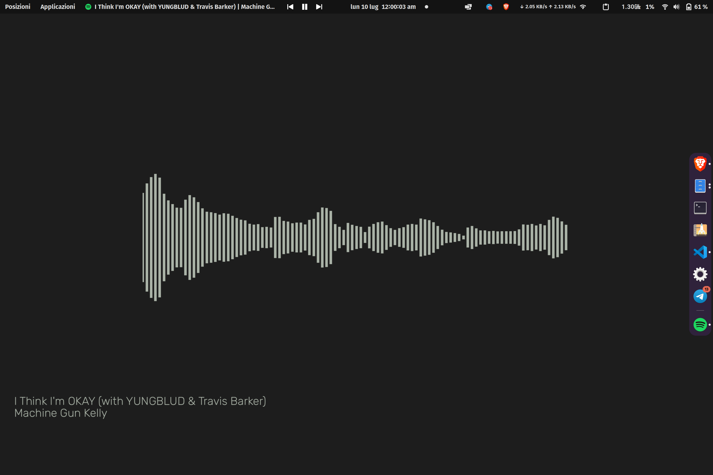

# SpotifySyncWall

 Currently Playing Spotify Song As Wallpaper for Gnome Desktop

 Once you stop the script, the wallpaper will be reset to the default one

## Images

There are 4 modes: Album Cover, Gradient, Blurred and Waveform. If you want to use only one of them, you can comment the others in `main.py`, on `__main__`function.




## Usage

1. Download the repo
2. Run `pip install -r requirements.txt` in terminal to install dependencies
3. Start listening to music on Spotify
4. Create and fill 'creds.txt' in the main directory (more info below)
5. Run src/main.py file
6. Log in if web page comes up
7. Copy link of web page after signing in and paste into terminal
8. Enjoy!

### creds.txt

Create a file called `creds.txt` in the main directory and fill it with the following:

``` txt
client_id = your_client_id
client_secret = your_client_secret
spot_username = your_spotify_username
```

### How to get client_id and client_secret

1. Go to <https://developer.spotify.com/dashboard/applications>
2. Log in with your Spotify account
3. Select 'Create an app'
4. Choose a name and description for your app, then click 'Create'
5. Click con 'Edit Settings' and set '<https://www.google.com/>' as new redirect URI, then Save
6. In the app page, copy the Client ID and Client Secret and paste them in the `creds.txt` file
7. Write your Spotify username in the `creds.txt` file
8. Save the file

### Note on display dimension

 Script automatically retrieve display dimension, using the first available in `xrandr`: if you want to use a custom one, change the second index in line 73, or decomment the following line and add your favorite resolution, following the already written pattern.

## TODO

### Short term

- [ ] Find a better way to check if colors are too similar
- [ ] Function that choose which color use as second one in each mode, based on some magic *distance* between colors
- [ ] Find a better way to leveling levels of loudness in waveform mode, so peaks are not too high compared to the rest of the image
- [ ] Add new fonts

### Medium term

- [ ] Add new modes
- [ ] Let user choose some parameters (ex. colors, gradient direction, etc.) without editing the code or stop the script

### Long term

- [ ] General optimization of the code
- [ ] Add a GUI (too far from now, I think)
- [ ] Compatibility with other desktop environments (same as above)
