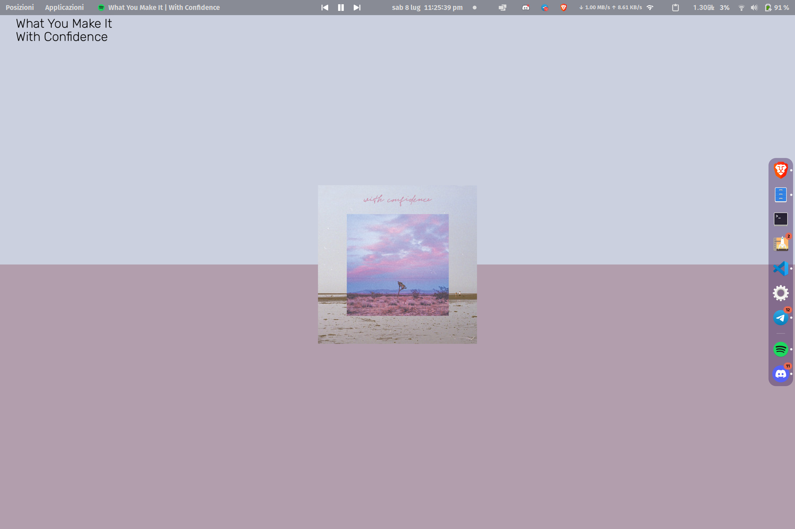
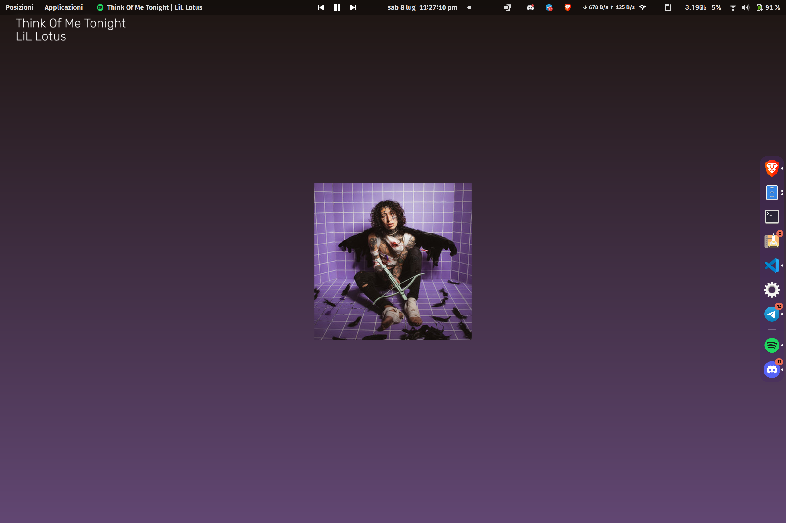
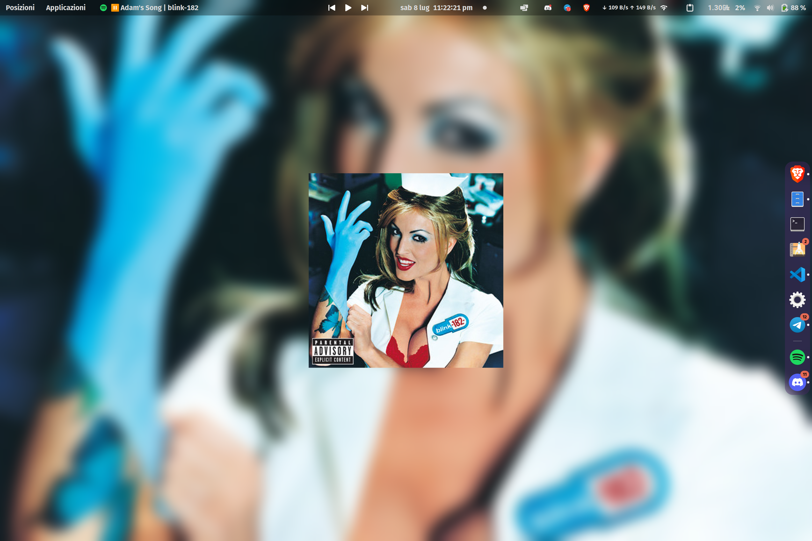

# SpotifySyncWall

 Currently Playing Spotify Song As Wallpaper for Gnome Desktop

 Once you stop the script, the wallpaper will be reset to the default one

## Images

There are 3 modes: Album Cover, Gradient and Blurred. If you want to use only one of them, you can comment the other two in `main.py`, on `__main__`function.







## Usage

1. Download the repo
2. Run `pip install -r requirements.txt` in terminal to install dependencies
3. Start listening to music on Spotify
4. Create and fill 'creds.txt' in the main directory (more info below)
5. Run src/main.py file
6. Log in if web page comes up
7. Copy link of web page after signing in and paste into terminal
8. Enjoy!

### creds.txt

Create a file called 'creds.txt' in the main directory and fill it with the following:

``` txt
client_id = your_client_id
client_secret = your_client_secret
spot_username = your_spotify_username
display_size = your_display_size (ex. 1920x1080)
```

### How to get client_id and client_secret

1. Go to <https://developer.spotify.com/dashboard/applications>
2. Log in with your Spotify account
3. Select 'Create an app'
4. Choose a name and description for your app, then click 'Create'
5. Click con 'Edit Settings' and set '<https://google.com/>' as new redirect URI, then Save
6. In the app page, copy the Client ID and Client Secret and paste them in the 'creds.txt' file
7. Write your Spotify username in the 'creds.txt' file
8. Copy your display size (ex. 1920x1080) and paste it in the 'creds.txt' file (you can find it in Settings -> Devices -> Display Resolution or running the command `xrandr` in terminal)
9. Save the file
